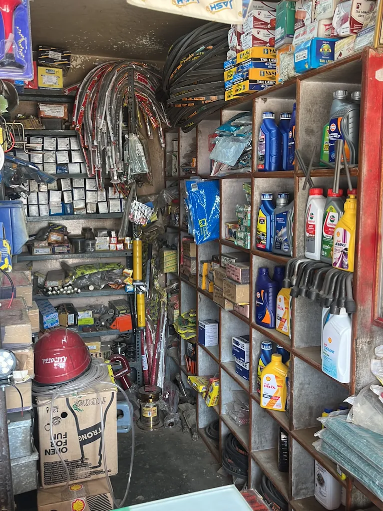

# 🏎️ MK Automobiles and Spare Parts

> **Premium Auto Parts & Oils Since 2008**  
> Top-quality lubricants, commercial spare parts, and fleet oils delivered fast across Bengaluru.

## 🌟 About Us

Located on **Varthur Main Road, Bengaluru**, MK Automobiles has been a trusted authorised retailer for over 15 years. We supply high-quality, genuine parts and lubricants to individual mechanics, school fleets, and large industrial factories.

### 🛠️ What We Offer
- **Premium Lubricants & Cooling:** High-viscosity engine oils, gear oils, coolants, and multi-purpose grease.
- **Commercial & Fleet Parts:** Heavy-duty camshafts, brake pads, suspension systems, and commercial braking components.
- **Electrical & LED:** Heavy-duty LED bars, fog lights, signals, and industrial wiring.

## 🤝 B2B & Institutional Supply
We provide tailored, scheduled supply contracts for:
- **School Fleets:** Trusted by Deens Academy and peers for scheduled monthly deliveries of critical maintenance items.
- **Industrial & Factory Supply:** Wholesale pricing and dedicated logistics for heavy-duty grease barrels and consumables.

## 🛵 Same-Day Rapido Delivery
Small spares, urgent oils, or weekend top-ups? We offer live-tracked, door-step delivery through our trusted **Rapido** partners across Bengaluru!

## 📞 Contact & Visit

- **Direct Line:** +91 98450 13086 *(Mon-Sat 9AM-8PM)*
- **WhatsApp:** [Message Our Team](https://wa.me/919845013086) for instant quotes.
- **Main Branch:** Varthur Main Rd, Varthur, Devasthanagalu, Bengaluru, Karnataka 560087

---
*This repository contains the source code for the official MK Automobiles landing page, built with modern, responsive, mobile-first HTML, CSS, and JS.*
